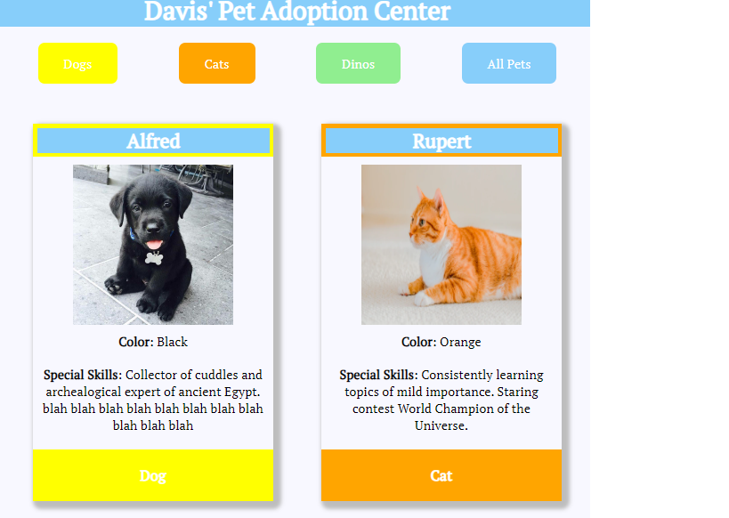

# pet-adoption

## Description
This project explored the use of the `domString` to render data on a web page using JS. This project aslo made much stronger use of CSS in styling. This project has event listeners that filter through the different types of pets.

## Screenshots

## How to run
1. Clone down this repo

1. Make sure you have http-server installed via npm. If not get it [HERE](https://www.npmjs.com/package/http-server).

1. In your command line run hs `-p 9999`

1. In your browser go to to `http://localhost:9999`
